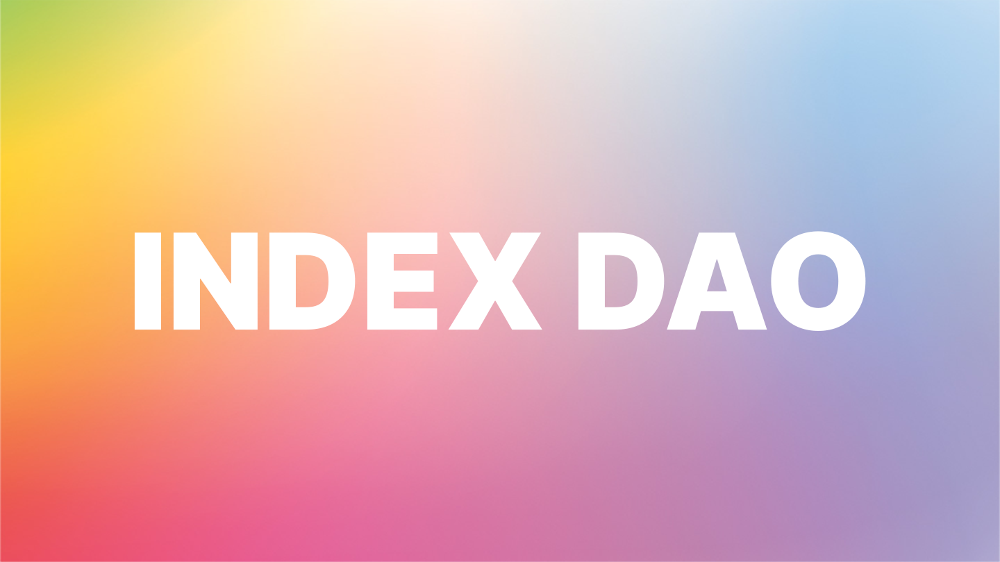

# Introduction

Index DAO is the first index of decentralized reserve currencies on the Avalanche network, with technology inspired by Olympus DAO.

What makes Index unique is that it accepts bonds for gOHM, MEMO, and all other DAOs that there are or are still to come. This means that as those DAOs grow, so does our treasury, providing a higher backing for INDEX. By combining all the DAOs tokens together into a single DAO we achieve a much more stable DAO with greater future returns than any single DAO can offer.

Additionally, Index will utilize its treasury in the future to acquire tokenized real world assets (such as real estate) to further diversify its treasury holdings, amplifying value and stability for INDEX holders.​

The financial industry has created numerous instruments to take advantage of leveraged strategies that compound their returns while only marginally increasing risk to their portfolio. One of such instruments is the “index”. An index is a combination of different stocks or instruments pooled together into one central fund that then can be purchased or sold in a single transaction which allows it to be used in more complex portfolio management strategies.

We’ve taken the strategic elements of the “index” and applied it to the revolutionary new wave of managed treasuries in the form of DAOs. Giving individuals the opportunity to gain access to all DAOs instead of having to interact with each individual one.
