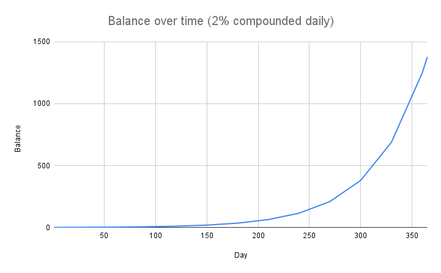

# FAQ

## Why do we need Index DAO in the first place?

Since the inception of Olympus DAO on Ethereum countless forks and clones have been launched on a variety of EVM chains. For a newcomer in the decentralized reserve currency ecosystem it can be overwhelming and difficult to determine which DAOs will succeed in the long term.

A common strategy in the financial industry is to hedge your bets by diversifying your portfolio into multiple different investments. However this is a time consuming process that takes consistent effort to maintain an edge.

This is why the financial industry has created numerous instruments to take advantage of leveraged strategies that compound their returns while only marginally increasing risk to their portfolio. One of such instruments is the “index”. An index is a combination of different stocks or instruments pooled together into one central fund that then can be purchased or sold in a single transaction which allows it to be used in more complex portfolio management strategies.

We’ve taken the strategic elements of the “index” and applied it to the revolutionary new wave of managed treasuries in the form of DAOs. Giving individuals the opportunity gain access to all DAOs instead of having to interact with each individual one.

What this means for INDEX holders is long term stability with the same short term upside offered by all of these other DAOs.

## How is Index DAO different or better than Olympus DAO?

What sets Index DAO apart is that it accepts bonds for gOHM, MEMO, and all other DAOs that there are or are still to come. This means that as those DAOs grow, so does our treasury, providing a higher backing for INDEX. By combining all the DAOs tokens together into a single DAO we achieve a much more stable DAO with greater future returns than any single DAO can offer.

## Is INDEX a stable coin?

No, INDEX is not a stable coin. Similar to the idea of the gold standard, INDEX provides free floating value its users can always fall back on, simply because of the fractional treasury reserves INDEX draws its intrinsic value from.

## How do I add Avalanche to my wallet?

To add Avalanche to MetaMask, click on the list of networks at the top of the extension window and select “Custom RPC.” Input the following parameters:

* **Network Name:** Avalanche Network
* **New RPC URL:** [https://api.avax.network/ext/bc/C/rpc](https://api.avax.network/ext/bc/C/rpc)
* **ChainID:** 43114
* **Symbol:** AVAX
* **Explorer:** [https://snowtrace.io/](https://snowtrace.io)

A video tutorial on the above process can be found here: [https://support.avax.network/en/articles/4626956-how-do-i-set-up-metamask-on-avalanche](https://support.avax.network/en/articles/4626956-how-do-i-set-up-metamask-on-avalanche).

## How do I bridge to Avalanche?

The easiest way to add funds to your wallet on Avalanche is to withdraw AVAX (the native token) directly from a centralised exchange (Coinbase, Hotbit, Gate, etc.). You can also bridge from other chains using any of the following popular options:

* **Avalanche Bridge:** [https://bridge.avax.network/](https://bridge.avax.network)
* **Synapse Bridge:** [https://synapseprotocol.com/](https://synapseprotocol.com)
* **AnySwap:** [https://stable.anyswap.exchange/](https://stable.anyswap.exchange)
* **xPollinate:** [https://www.xpollinate.io/](https://www.xpollinate.io)
* **ElkDex:** [https://app.elk.finance/](https://app.elk.finance)
* **cBRIDGE**: [https://cbridge.celer.network/#/transfer](https://cbridge.celer.network/#/transfer)
* **allbridge**: [https://app.allbridge.io/](https://app.allbridge.io)

Please note: you will need AVAX in your wallet to perform transactions on the Avalanche C-Chain. If you bridge non-AVAX funds (USDC, WETH, etc.) onto Avalanche and have no AVAX in your wallet, you will not be able to perform any transactions with those funds.

Currently, there is no “faucet” for the Avalanche chain for supplying small amounts of AVAX. However, if you bridge over more than approximately $75 worth of tokens via the Avalanche Bridge (which only connects the Ethereum mainnet to the Avalanche C-Chain), the bridge will automatically airdrop a small amount of AVAX into your wallet. Another alternatives are Synapse and ElkDex, which swap a small part of your bridged token for AVAX for transaction fees.

## What is (📈,📈) or (27,27)?

(📈,📈), also known as (27,27), is similar to (3,3) in Olympus which represents minting and then staking. We call this (27,27) instead of (3,3) because with Olympus you can only stake stablecoins (and on occasion other tokens such as ETH or SUSHI) whereas with Index you can stake your staked Olympus tokens (gOHM) which amplifies the Olympus strategy to a higher exponential. So (3,3) become (3^3,3^3) or (27,27).

If everyone cooperates in Index DAO, it would generate the greatest gain for everyone (from a [game theory](https://en.wikipedia.org/wiki/Game\_theory) standpoint). Currently, there are three actions a user can take:

* Staking (+2)
* Minting (Bonding) (+1)
* Selling (-2)

Staking and minting are considered beneficial to the protocol, while selling is considered detrimental. Staking and selling will also cause a price move, while minting (bonding) does not (we consider buying INDEX from the market as a prerequisite of staking, thus causing a price move). If both actions are beneficial, the actor who moves price also gets half of the benefit (+1). If both actions are contradictory, the bad actor who moves price gets half of the benefit (+1), while the good actor who moves price gets half of the downside (-1). If both actions are detrimental, which implies both actors are selling, they both get half of the downside (-1).

* If we both stake (3,3), it is the best thing for both of us and the protocol (3,3)
* If one of us stakes and the other one mints, it is also great because staking takes INDEX off the market and put it into the protocol, while minting provides liquidity and assets for the treasury
* When one of us sells, it diminishes effort of the other one who stakes or mints
* When we both sell, it creates the worst outcome for both of us and the protocol (-3,-3)

Now, since this strategy is true for all protocols based on Olympus, when it is applied to Index DAO using their staked tokens the strategy is amplified and (3,3) becomes (27,27).

## Why is [Protocol Controlled Value](../protocol-internals/glossary.md#pcv) (PCV) important?

As the protocol controls the funds in its treasury, INDEX can only be minted or burned by the protocol. This also guarantees that the protocol can always back 1 INDEX with 1 MIM. You can easily define the risk of your investment because you can be confident that the protocol will indefinitely buy INDEX below 1 MIM with the treasury assets until no one is left to sell. You can't trust the FED but you can trust the code.

As the protocol accumulates more PCV, more runway is guaranteed for the stakers. This means the stakers can be confident that the current staking APY can be sustained for a longer term because more funds are available in the treasury.

## Why is [Protocol Owned Liquidity](../protocol-internals/glossary.md#pol) (POL) important?

Index DAO owns most of its liquidity thanks to its bond mechanism. This has several benefits:

* Index DAO does not have to pay out high farming rewards to incentivise liquidity providers, a.k.a renting liquidity
* Index DAO guarantees the market that the liquidity is always there to facilitate sell or buy transactions
* By being the largest LP (liquidity provider), it earns most of the LP fees which represents another source of income to the treasury
* All POL can be used to back Index. The LP tokens are marked down to their risk-free value for this purpose. You can read more about the rationale behind this in this [Medium article](https://olympusdao.medium.com/dai-bonds-a-more-effective-sales-mechanism-c9a57586f1f7) made by Olympus.

## Why is the market price of INDEX so volatile?

It is extremely important to understand how early in development the Index DAO protocol is. At launch the network will be tuned for expansion of INDEX supply, which when paired with the staking, minting, and yield mechanics of Index DAO, result in a fair amount of volatility.

INDEX could trade at a very high price because the market is ready to pay a hefty premium to capture a percentage of the current market capitalization. However, the price of INDEX could also drop to a large degree if the market sentiment turns bearish. We would expect significant price volatility during our growth phase so please **do your own research** whether this project suits your goals.

## What is the point of buying INDEX when it trades at a premium?

When you buy and stake INDEX, you capture a percentage of the supply (market cap) which will remain close to a constant. This is because your staked INDEX balance also increases along with the circulating supply. The implication is that if you buy INDEX when the market cap is low, you would be capturing a larger percentage of the market cap.

## What is a rebase?

Rebase is a mechanism by which your staked INDEX balance increases automatically. When new INDEX are minted by the protocol, a large portion of it goes to the stakers. Because stakers only see staked INDEX balance instead of INDEX, the protocol utilises the rebase mechanism to increase the staked INDEX balance so that 1 staked INDEX is always redeemable for 1 INDEX.

## What is reward yield?

Reward yield is the percentage by which your staked INDEX balance increases on the next epoch. It is also known as _rebase rate_. You can find this number on the [Index DAO staking page](https://app.indexdao.finance/#/stake).

## What is APY?

APY stands for annual percentage yield. It measures the real rate of return on your principal by taking into account the effect of compounding interest. In the case of Index DAO, your staked INDEX represents your principal, and the compound interest is added periodically on every epoch (around 8 hours) thanks to the rebase mechanism. One interesting fact about APY is that your balance will grow not linearly but exponentially over time! Assuming a daily compound interest of 2%, if you start with a balance of 1 INDEX on day 1, after a year, your balance will grow to about 1377.

## How is the APY calculated?

The APY is calculated from the reward yield (a.k.a rebase rate) using the following equation:

$$
APY = ( 1 + rewardYield )^{1095}
$$

It raises to the power of 1095 because a rebase happens 3 times daily. Consider there are 365 days in a year, this would give a rebase frequency of 365 \* 3 = 1095.

Reward yield is determined by the following equation:

$$
rewardYield = INDEX_{distributed} / INDEX_{totalStaked}
$$

The number of INDEX distributed to the staking contract is calculated from INDEX total supply using the following equation:

$$
INDEX_{distributed} = INDEX_{totalSupply} \times rewardRate
$$

Note that the reward rate is subject to change by the protocol.

## Why does the price of INDEX become irrelevant in long term?

As illustrated above, your INDEX balance will grow exponentially over time thanks to the power of compounding. Let's say you buy an INDEX for $400 now and the market decides that in 1 year time, the intrinsic value of INDEX will be $2. Assuming a daily compound interest rate of 2%, your balance would grow to about 1377 INDEX by the end of the year, which is worth around $2754. That is a cool $2354 profit! By now, you should understand that you are paying a premium for INDEX now in exchange for a long-term benefit. Thus, you should have a long time horizon to allow your INDEX balance to grow exponentially and make this a worthwhile investment.

## What will be the intrinsic value of INDEX in the future?

There is no clear answer for this, but the intrinsic value can be determined by the treasury performance. For example, if the treasury could guarantee to back every INDEX with 100 MIM, the intrinsic value will be 100 MIM. It can also be decided by the DAO. For example, if the DAO decides to raise the price floor of INDEX, its intrinsic value will rise accordingly.

## How does the protocol manage to maintain the high staking APY?

Let’s say the protocol targets an APY range of 1,000% to 10,000%, this would translate to a _minimum_ reward yield of about 0.2105%, or a daily growth of about 0.6328%. Please refer to the equation above to learn [how APY is calculated from the reward yield](faq.md#how-is-the-apy-calculated).

If there are 100,000 of INDEX staked right now, the protocol would need to mint an additional 632.8 INDEX to achieve this daily growth. This is achievable if the protocol can bring in at least $632.80 of daily revenue from bond sales. Even if the protocol doesn't bring in that much revenue, it can still sustain 1,000% APY for a considerable amount of time due to the excess reserve in the treasury.

## Do I have to unstake and stake INDEX on every epoch to get my rebase rewards?

No. Once you have staked INDEX with Index DAO, your staked INDEX balance will auto-compound on every epoch. That increase in balance represents your rebase rewards.

## How do I track my rebase rewards?

You can track your rebase rewards by calculating the increase in your staked INDEX balance.

1.) Record down the `Current Index` value on the [staking page](https://app.indexdao.finance/#/stake) when you first stake your INDEX. Let's call this the `Start Index`.

2.) After staking for some time, if you want to determine by how much your balance has increased, check the `Current Index` value again. Let's call this the `End Index`.

3.) By dividing the `End Index` by `Start Index`, you would get the ratio by which your staked INDEX balance has increased.

$$
ratio = endIndex / startIndex
$$
